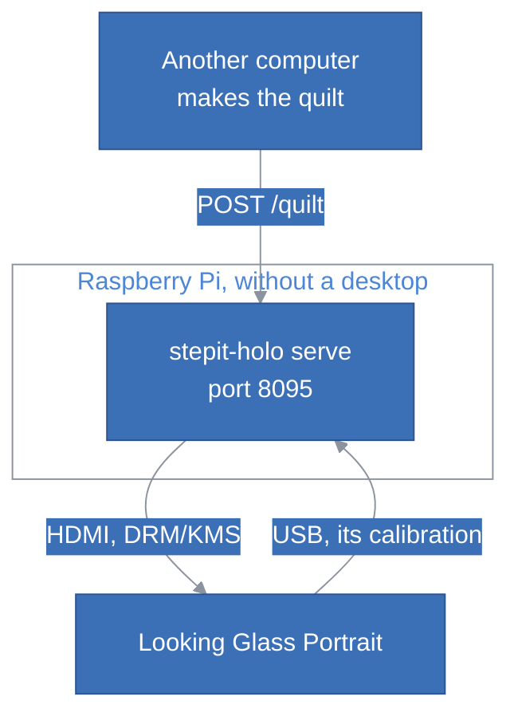

# StepIt Holo

## Table of Contents <!-- omit in toc -->

- [Introduction](#introduction)
- [Try It](#try-it)
- [Prerequisites](#prerequisites)
- [Install StepIt Holo](#install-stepit-holo)
  - [Check out the Git Repository](#check-out-the-git-repository)
  - [Install the Command](#install-the-command)
- [Running the Application](#running-the-application)
  - [Show a Quilt](#show-a-quilt)
  - [Show Without a Desktop](#show-without-a-desktop)
  - [Check the Looking Glass with Numbered Views](#check-the-looking-glass-with-numbered-views)
  - [Save a Hologram](#save-a-hologram)
  - [See the Calibration](#see-the-calibration)
- [The Server](#the-server)
  - [Start the Server](#start-the-server)
  - [Upload a Quilt](#upload-a-quilt)
  - [Run the Server in Docker](#run-the-server-in-docker)
  - [A Clean Screen at Boot](#a-clean-screen-at-boot)
- [Use It as a Library](#use-it-as-a-library)
- [Tests](#tests)
- [Troubleshooting](#troubleshooting)
- [Licences](#licences)

## Introduction

StepIt Holo shows quilts on a **Looking Glass Portrait**, Looking Glass Factory's 7.9" 3D display, as holograms. It runs on Ubuntu and on Raspberry Pi OS, with Python, numpy and Pillow: in a window on a desktop, with GTK, or straight on the screen, without a desktop, e.g. on a Raspberry Pi with Raspberry Pi OS Lite.

A quilt is the format of Looking Glass's still holograms: one image holding a grid of views of a scene, each seen from a slightly different direction, 48 views in 8 columns and 6 rows for the Portrait. StepIt Holo:

- reads the Portrait's calibration from the Portrait itself, which carries it on its own USB drive;
- interleaves the quilt into the image the Portrait's screen must show, so that each eye sees the right view through its lenses;
- shows that image full-screen on the Portrait, pixel for pixel: on a desktop, whatever monitor it puts new windows on; without one, through DRM/KMS, the kernel's own access to the screens;
- as a server, shows the quilts that any computer on the network uploads, over HTTP.

It works with any quilt, from any software that makes them.

> [!NOTE]
> StepIt Holo is made and tested with the Looking Glass Portrait only. Looking Glass's other displays use the same kind of calibration and may work, but none has been tried, and some carry calibration values that StepIt Holo does not use, see [Other Looking Glass Models](#troubleshooting).

## Try It

The repo holds a sample quilt for the Looking Glass Portrait, [`quilts/wasp_qs8x6a0.75.jpg`](quilts/wasp_qs8x6a0.75.jpg): a wasp, a macro photograph taken from 48 angles, 8 x 6 views of 420 x 560. With the [prerequisites](#prerequisites) in place, it takes three commands to see it in 3D:

```bash
git clone https://github.com/kineticsystem/stepit-holo.git
cd stepit-holo
./stepit-holo show quilts/wasp_qs8x6a0.75.jpg
```

Through the lenses, the wasp stands in front of a white background, and turns as you move your head sideways. Press Escape or `q` on its window to close it.

## Prerequisites

- **Ubuntu 24.04 or Raspberry Pi OS (Bookworm or Trixie).** With a desktop: GNOME on X11 or on Wayland, or Raspberry Pi OS's own, on Wayland; other Linux desktops should work. Without one: any Linux, e.g. Raspberry Pi OS Lite.
- **Python 3.11 or later, numpy and Pillow,** from the system's packages, with GTK 3's Python bindings on a desktop:

  ```bash
  sudo apt install python3-numpy python3-pil python3-gi gir1.2-gtk-3.0
  ```

  Without a desktop, `libdrm2`, which every Raspberry Pi OS and Ubuntu has, replaces GTK. The server, `stepit-holo serve`, also needs FastAPI, uvicorn and python-multipart: `sudo apt install python3-fastapi python3-uvicorn python3-multipart` on Ubuntu 24.04, `python3-python-multipart` instead of `python3-multipart` on Raspberry Pi OS Trixie and Debian 13, whose `python3-multipart` is another library. [Run the Server in Docker](#run-the-server-in-docker) needs none of them, only Docker.
- **A Looking Glass Portrait,** on HDMI and on USB to the same computer. The USB cable must carry data, not only power: through it, the computer sees the display's drive, with its calibration. A desktop mounts it, e.g. on `/media/<user>/LKG-P00671`; without one, see [Show Without a Desktop](#show-without-a-desktop).
- **On a desktop,** the Looking Glass is part of the desktop in the display settings ("Join Displays"), in its own orientation. StepIt Holo draws at 100% whatever the desktop's scaling, so a whole factor, e.g. 200% on a 4K desktop, works too; a fractional one, e.g. 150%, does not under X11, where GNOME scales the whole screen image.

> [!IMPORTANT]
> Close Looking Glass Bridge if it runs: it would draw over StepIt Holo's window.

## Install StepIt Holo

### Check out the Git Repository

```bash
git clone https://github.com/kineticsystem/stepit-holo.git
cd stepit-holo
```

The command runs from the checkout as it is, with no installation:

```bash
./stepit-holo show quilts/wasp_qs8x6a0.75.jpg
```

### Install the Command

To have `stepit-holo` on the `PATH`, install it with pipx, which both Ubuntu and Raspberry Pi OS package. `--system-site-packages` lets it use the system's numpy, Pillow, GTK bindings and, for the server, FastAPI and uvicorn:

```bash
sudo apt install pipx
pipx install --system-site-packages git+https://github.com/kineticsystem/stepit-holo.git
```

Without the system's packages of the server, the extra `server` installs FastAPI, uvicorn and python-multipart with the command:

```bash
pipx install --system-site-packages "stepit-holo[server] @ git+https://github.com/kineticsystem/stepit-holo.git"
```

## Running the Application

### Show a Quilt

```bash
./stepit-holo show quilts/wasp_qs8x6a0.75.jpg
```

The hologram fills the Looking Glass until you press Escape or `q` on its window, or stop the command. The command says `Showing on the monitor at ...` once the window covers the Looking Glass, and ends without an error on Ctrl+C or `SIGTERM`.

The layout comes from the file's name, as Looking Glass's own tools read it: `_qs8x6a0.75` is 8 columns, 6 rows, views of aspect 0.75. For a quilt whose name does not say, give it:

```bash
./stepit-holo show my-quilt.png --columns 8 --rows 6
```

If the depth looks inside out, near parts behind far ones, the quilt's views go the other way. Add `--reverse`.

The sample quilt, [`quilts/wasp_qs8x6a0.75.jpg`](quilts/wasp_qs8x6a0.75.jpg), is a quilt to compare yours with: it is known to look right on a Portrait.

### Show Without a Desktop

On a computer with no desktop, e.g. a Raspberry Pi with Raspberry Pi OS Lite, StepIt Holo shows the hologram straight on the screen, through DRM/KMS: it sets the Looking Glass's own mode, 1536 x 2048 for a Portrait, and gives the display controller the hologram, pixel for pixel. It does so by itself when a graphics card has a connected screen that no other program drives, whatever `DISPLAY` says, e.g. over `ssh -X`; `--screen drm` asks for it:

```bash
./stepit-holo show quilts/wasp_qs8x6a0.75.jpg --screen drm
```

The command says `Showing on HDMI-A-1 of /dev/dri/card1, 1536 x 2048`, and the hologram stays until Ctrl+C, when the console comes back. Our user must be in the group `video`, which owns `/dev/dri/card*`: Raspberry Pi OS puts the first user in it.

Without a desktop, nothing mounts the Looking Glass's drive. Mount it once by its label, read-only, where StepIt Holo looks for it:

```bash
ls /dev/disk/by-label/
sudo mkdir -p /media/$USER/LKG-P00671
sudo mount -o ro /dev/disk/by-label/LKG-P00671 /media/$USER/LKG-P00671
```

Or copy its `LKG_calibration/visual.json` once, and give it with `--calibration visual.json`. The server mounts the drive itself with `--mount-drive`, which needs root: [its container](#run-the-server-in-docker) does so.

> [!IMPORTANT]
> DRM/KMS works only where no desktop drives the screens: a desktop holds them, and the command then says `Permission denied: another program drives the screens`. On a desktop, use the default, `--screen desktop`.

### Check the Looking Glass with Numbered Views

```bash
./stepit-holo numbers
```

It shows a test quilt whose 48 views each show their number, 1 to 48, large, on a colour of their own. Through the lenses, one number fills the screen, and it changes in order as you move your head sideways. Some ghosting of the next numbers is normal: neighbouring views are this different only in the test. A mix of numbers across the screen, or a white blur, means that the calibration is wrong, or that the window does not cover the Looking Glass exactly. `--quilt-output numbers_qs8x6a0.75.png` saves the test quilt instead of showing it.

### Save a Hologram

```bash
./stepit-holo render quilts/wasp_qs8x6a0.75.jpg -o hologram.png
```

It saves the image the Looking Glass would show, of the screen's size, e.g. 1536 x 2048, without showing it: it needs no desktop. It still needs the calibration: the Looking Glass's drive, or `--calibration visual.json`, a copy of it.

### See the Calibration

```bash
./stepit-holo calibration
```

It prints where it found the calibration, and the values it derives from it. Every command takes `--calibration <file>` to use a copy of `visual.json` instead of the drive's, e.g. on a computer the Looking Glass is not plugged into.

## The Server

`stepit-holo serve` shows on the Looking Glass the quilts that other computers upload over HTTP, on port 8095. A quilt replaces the one before, and stays until the next one, also across a restart. The Looking Glass then needs only a small computer of its own, e.g. a Raspberry Pi without a desktop, while the quilts are made elsewhere, e.g. on a PC, and uploaded when they are ready.



The API is documented in [docs/API.md](docs/API.md), and live, with a page to try each request, on `http://<host>:8095/docs`.

> [!WARNING]
> The server has no authentication: anyone who reaches its port can change what the Looking Glass shows. Keep it on a network you trust.

### Start the Server

```bash
./stepit-holo serve
```

It chooses its screen as `show` does: straight on a screen that nothing drives, the desktop otherwise; `--screen` chooses. The options:

| Option | Default | What it is |
|---|---|---|
| `--host` | `0.0.0.0` | The address to listen on: every one, so that other computers reach it. `127.0.0.1` for this computer only. |
| `--port` | `8095` | The port. |
| `--screen` | `auto` | `desktop`, a full-screen window; `drm`, straight on the screen; `auto`, the screen itself if nothing drives it, the desktop otherwise. |
| `--calibration` | the Looking Glass's drive | A copy of `visual.json`. |
| `--state` | `~/.local/state/stepit-holo` | Where the last quilt is kept, to show it again after a restart. |
| `--default-quilt` | none | What to show when no quilt is kept, e.g. at the first start or after `DELETE /quilt`: `numbers`, the test quilt, or a quilt file whose name gives its layout, e.g. `quilts/wasp_qs8x6a0.75.jpg`. It is shown, not kept: an upload replaces it. |
| `--mount-drive` | off | Mounts the Looking Glass's drive, read-only, when nothing has, e.g. without a desktop. Needs root. |

The server reads the calibration at the first quilt. If it cannot show a quilt, because the Looking Glass is not plugged in or switched off, it keeps it, answers `503` with the reason, and tries again every 5 seconds: the quilt shows as soon as the Looking Glass is there.

### Upload a Quilt

From any computer, with `curl`:

```bash
curl -F file=@quilts/wasp_qs8x6a0.75.jpg http://raspberrypi.local:8095/quilt
```

It answers once the quilt is on the Looking Glass, with what it shows:

```json
{"name": "wasp_qs8x6a0.75.jpg", "columns": 8, "rows": 6, "reverse": false, "width": 3360, "height": 3360,
 "uploaded": "2026-10-09T10:07:27+00:00", "shown": true, "shown_on": "HDMI-A-1 of /dev/dri/card1, 1536 x 2048",
 "error": null}
```

The layout comes from the name, as for `show`, or from the fields `columns` and `rows`, with `reverse` for views in the other order: `-F columns=8 -F rows=6 -F reverse=true`. From Python, with `requests`:

```python
import requests

with open("wasp_qs8x6a0.75.jpg", "rb") as quilt:
    response = requests.post("http://raspberrypi.local:8095/quilt", files={"file": quilt}, timeout=60)
response.raise_for_status()
```

`GET /status` says what is shown, `POST /numbers` shows the test quilt, and `DELETE /quilt` shows black, see [docs/API.md](docs/API.md).

### Run the Server in Docker

The server also runs in a container, `stepit-holo`, on a computer without a desktop, e.g. a Raspberry Pi with Raspberry Pi OS Lite, alone or next to other containers. The container needs only Docker on the host: Debian's packages of Python, numpy, Pillow, FastAPI, uvicorn and libdrm are in the image, for amd64 and arm64. It shows through DRM/KMS, and mounts the Looking Glass's drive itself, read-only, inside the container.

Check out the repo on that computer, then build the image and start the server:

```bash
git clone https://github.com/kineticsystem/stepit-holo.git
cd stepit-holo
./docker/dock.sh build
./docker/dock.sh start
```

The server then starts with the computer, until `./docker/dock.sh stop`. The commands:

| Command | What it does |
|---|---|
| `build` | Builds the image, `stepit-holo:latest`. |
| `start` | Starts the server in the background. |
| `logs` | Follows the server's output. |
| `status` | Shows the state of the container. |
| `shell` | Opens a terminal into the container. |
| `stop` | Stops the server, until the next `start`. |
| `clean` | Removes the container and the image; the volume of the last quilt, `stepit-holo_state`, stays. |

The image holds no code: the container runs the checkout, mounted read-only, so updating it is a pull and a restart:

```bash
git pull
./docker/dock.sh stop && ./docker/dock.sh start
```

With no quilt kept, the container shows the sample wasp, [`quilts/wasp_qs8x6a0.75.jpg`](quilts/wasp_qs8x6a0.75.jpg). `STEPIT_HOLO_DEFAULT_QUILT=numbers ./docker/dock.sh start` shows the test quilt instead, or any quilt of the repo by its path.

The container is privileged and runs as root, which setting the screen's mode and mounting the drive need; it mounts the host's `/dev`, so that the Looking Glass can be unplugged and plugged in again, and listens on the host's network, on port 8095, or `STEPIT_HOLO_PORT`. Its volume, `stepit-holo_state`, keeps the last quilt and the tables of the interleaving.

> [!IMPORTANT]
> On a computer with a desktop, the container cannot show: the desktop holds the screens. There, run `./stepit-holo serve` outside Docker.

### A Clean Screen at Boot

On a Raspberry Pi without a desktop, the screen shows the Pi's console until the server draws: the rainbow splash, the kernel's messages and the login prompt, for the minute or so the Pi and Docker take to start. Three changes leave it black instead, until the quilt appears.

In `/boot/firmware/cmdline.txt`, one line, replace `console=tty1` with `console=tty3`, which moves the kernel's messages off the screen, and add at the end of the line:

```
quiet loglevel=3 logo.nologo vt.global_cursor_default=0 consoleblank=0
```

`vt.global_cursor_default=0` hides the blinking cursor, and `consoleblank=0` keeps the console from blanking the screen.

At the end of `/boot/firmware/config.txt`, for no rainbow splash at power-on:

```
disable_splash=1
```

And no login prompt on the screen:

```bash
sudo systemctl disable getty@tty1
```

Reboot. The login prompt is only of use with a keyboard and a user with a password: SSH is not affected. `sudo systemctl enable getty@tty1` brings it back.

## Use It as a Library

```python
import numpy as np
from PIL import Image

from stepit_holo import Interleaver, Layout, find_calibration

calibration = find_calibration()
quilt = np.asarray(Image.open("quilts/wasp_qs8x6a0.75.jpg").convert("RGB"))
interleaver = Interleaver(calibration, Layout(8, 6), quilt.shape[1], quilt.shape[0])
hologram = interleaver(quilt)  # An RGB array of the screen's size.
```

An `Interleaver` works out once which sub-pixel of the quilt each sub-pixel of the screen takes, about a third of a second on a PC, and keeps the table in `~/.cache/stepit-holo`. Every quilt of the same layout and size then takes a lookup, about 15 ms on a PC. `stepit_holo.screen.open_screen()` opens the screen to show it on, see [The Screens](docs/ARCHITECTURE.md#the-screens).

## Tests

```bash
python3 -m unittest discover tests
```

The tests need no display: they check the calibration, the layouts, the interleaving against views checked through a Portrait's lenses, the test quilt, the DRM screen's helpers, the command line and, with FastAPI, httpx and python-multipart installed, the server with a fake screen. Without them, the server's tests are skipped.

## Troubleshooting

**`no Looking Glass found`.** The display's drive is not mounted. Check that its USB cable is plugged into this computer and carries data: `lsusb` lists `Looking Glass Portrait`, or your model, once it does, and the desktop mounts the drive a few seconds later.

**`no monitor of 1536 x 2048`.** The Looking Glass is not part of the desktop at its own resolution: it is off, not on HDMI, mirrored instead of joined, or scaled by a fractional factor. In the display settings, join it to the desktop, at 100% or a whole factor such as 200%.

**`no screen of 1536 x 2048`, without a desktop.** No connected screen of the Looking Glass's size: it is off, or not on HDMI. The message lists the screens it found, with their sizes.

**`Permission denied: another program drives the screens`.** A desktop holds the screens, so DRM/KMS cannot set their mode: use `--screen desktop`, or stop the desktop. Without a desktop, our user is not in the group `video`: `sudo usermod -aG video $USER`, and log in again.

**The server answers `503`, and the quilt is kept.** It cannot show yet: the message says why, e.g. `no Looking Glass found` or `no screen of 1536 x 2048`. It tries again every 5 seconds, and `GET /status` says when it is shown.

**The container's log says `Form data requires "python-multipart"`.** The image has Debian's `python3-multipart`, another library: build it again from this repo's [`docker/Dockerfile`](docker/Dockerfile), which installs `python3-python-multipart`.

**A grid of small images through the lenses.** The quilt is shown flat, as by a program that does not interleave it, e.g. Looking Glass Bridge in its window. Close the other program, and show the quilt with `stepit-holo show`.

**A mix of numbers with `stepit-holo numbers`.** The window is not exactly on the Looking Glass, or the calibration is another display's. Check `stepit-holo calibration` against the drive of the display, and that the desktop's scaling is a whole factor, e.g. 100% or 200%.

**Other Looking Glass models.** They are untested. StepIt Holo uses the values that the Portrait's calibration holds, as Looking Glass's WebXR library uses them, and reads the screen's size from the calibration, so another model may work as it is. A model whose `visual.json` has `subpixelCells`, e.g. one of the newer ones, lays out its sub-pixels differently, which StepIt Holo ignores, and will not. `stepit-holo numbers` shows which: one number at a time through the lenses, or a mix. The test quilt is a Portrait's, 8 x 6 views of aspect 0.75; on another model, its views are stretched, but the numbers still show.

## Licences

StepIt Holo is released under the MIT licence, see [`LICENSE`](LICENSE).

The interleaving follows the formulas of Looking Glass's lenticular shader as their [WebXR library](https://github.com/Looking-Glass/looking-glass-webxr) publishes them, under the Apache 2.0 licence. StepIt Holo contains none of their code, and is not made or endorsed by Looking Glass Factory. Looking Glass is their trademark.

| Software | Licence | Role |
|---|---|---|
| [numpy](https://numpy.org/) | BSD 3-Clause | The interleaving. |
| [Pillow](https://python-pillow.org/) | HPND, BSD-like | Reads and writes the images. |
| [PyGObject](https://pygobject.gnome.org/) and [GTK](https://www.gtk.org/) | LGPL 2.1 | The full-screen window. |
| [libdrm](https://gitlab.freedesktop.org/mesa/drm) | MIT | The screen, without a desktop. |
| [FastAPI](https://fastapi.tiangolo.com/), [uvicorn](https://www.uvicorn.org/) and [python-multipart](https://github.com/Kludex/python-multipart) | MIT, BSD 3-Clause, Apache 2.0 | The server. |
