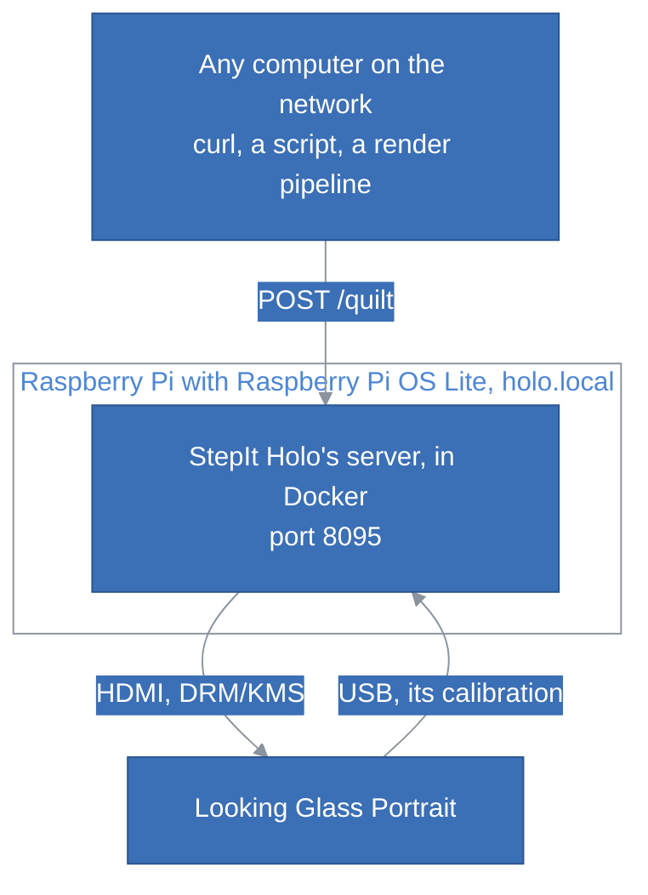

# StepIt Holo

## Table of Contents <!-- omit in toc -->

- [Introduction](#introduction)
- [Prerequisites](#prerequisites)
- [Set Up the Raspberry Pi](#set-up-the-raspberry-pi)
  - [Install Raspberry Pi OS Lite](#install-raspberry-pi-os-lite)
  - [Install Docker and Git](#install-docker-and-git)
  - [Install StepIt Holo](#install-stepit-holo)
  - [A Clean Screen at Boot](#a-clean-screen-at-boot)
- [Show Quilts](#show-quilts)
  - [Upload a Quilt](#upload-a-quilt)
  - [Check the Looking Glass with Numbered Views](#check-the-looking-glass-with-numbered-views)
  - [What the Looking Glass Shows](#what-the-looking-glass-shows)
- [Manage the Server](#manage-the-server)
- [Other Ways to Run StepIt Holo](#other-ways-to-run-stepit-holo)
  - [On a Desktop](#on-a-desktop)
  - [The Server Without Docker](#the-server-without-docker)
  - [The Command Line Without a Desktop](#the-command-line-without-a-desktop)
  - [Save a Hologram and See the Calibration](#save-a-hologram-and-see-the-calibration)
  - [Use It as a Library](#use-it-as-a-library)
- [Tests](#tests)
- [Troubleshooting](#troubleshooting)
- [Licences](#licences)

## Introduction

StepIt Holo turns a Raspberry Pi into a network display for the **Looking Glass Portrait**, Looking Glass Factory's 7.9" 3D display. Plug the Portrait into the Pi, and any computer on the network shows a hologram on it with one HTTP request:

```bash
curl -F file=@wasp_qs8x6a0.75.jpg http://holo.local:8095/quilt
```

The hologram is a quilt, the format of Looking Glass's still holograms: one image holding a grid of views of a scene, each seen from a slightly different direction, 48 views in 8 columns and 6 rows for the Portrait. It works with any quilt, from any software that makes them: a render, a photo session, a script. On the Pi, StepIt Holo:

- reads the Portrait's calibration from the Portrait itself, which carries it on its own USB drive;
- interleaves the quilt into the image the Portrait's screen must show, so that each eye sees the right view through its lenses;
- shows that image on the Portrait, pixel for pixel, straight through the Pi's HDMI, with no desktop and no window;
- keeps the last quilt, and shows it again after the Pi restarts, or a test quilt until the first one comes.



The Pi needs only Docker: StepIt Holo runs in a container that starts with the Pi. On a Pi 5, a quilt is on the Portrait about 0.3 seconds after its upload, and the Portrait shows a hologram about a minute and a half after the Pi is switched on.

StepIt Holo also runs without a Pi, on an Ubuntu desktop with the Portrait as a second monitor, see [Other Ways to Run StepIt Holo](#other-ways-to-run-stepit-holo).

> [!NOTE]
> StepIt Holo is made and tested with the Looking Glass Portrait and a Raspberry Pi 5 only. Looking Glass's other displays use the same kind of calibration and may work, but none has been tried, see [Other Looking Glass Models](#troubleshooting). A Raspberry Pi 4 runs the same system, and should work too.

## Prerequisites

- **A Raspberry Pi 5,** with its power supply and a microSD card of 8 GB or more.
- **A Looking Glass Portrait,** on the Pi's HDMI, with a micro-HDMI to HDMI cable, and on one of the Pi's USB ports, with a cable that carries data, not only power: through it, the Pi reads the Portrait's calibration from its drive.
- **A network,** Ethernet or Wi-Fi, that the Pi and the computers that send quilts share.
- **A computer to set up the Pi,** with [Raspberry Pi Imager](https://www.raspberrypi.com/software/) and an SD card reader, and an SSH client.

> [!WARNING]
> The server has no authentication: anyone who reaches its port can change what the Looking Glass shows. Keep it on a network you trust.

## Set Up the Raspberry Pi

### Install Raspberry Pi OS Lite

StepIt Holo draws on the Portrait itself, which only works where no desktop holds the screen: install Raspberry Pi OS **Lite**, without a desktop. In Raspberry Pi Imager, on the computer:

1. **Device:** Raspberry Pi 5.
2. **Operating system:** Raspberry Pi OS (other), then Raspberry Pi OS Lite (64-bit).
3. **Storage:** the microSD card.
4. **Customisation,** when Imager offers to edit the settings:
   - the hostname, e.g. `holo`, which the examples here use: the Pi is then `holo.local` on the network;
   - a user and a password;
   - the Wi-Fi network and its country, unless the Pi is on Ethernet;
   - SSH on, with public-key authentication, and our public key, e.g. the contents of `~/.ssh/id_ed25519.pub`.

Write the card, put it in the Pi, and switch the Pi on. After a minute or two, log in from the computer:

```bash
ssh <user>@holo.local
```

Every command below runs on the Pi, in that SSH session.

### Install Docker and Git

Install git and Docker, and add our user to the group `docker`, to run Docker without `sudo`:

```bash
sudo apt update && sudo apt full-upgrade -y
sudo apt install -y git
curl -fsSL https://get.docker.com | sudo sh
sudo usermod -aG docker $USER
sudo reboot
```

The group applies at the next login. Log in again, and check that Docker works without `sudo`:

```bash
docker run --rm hello-world
```

### Install StepIt Holo

Check out the repo, build the image and start the server:

```bash
git clone https://github.com/kineticsystem/stepit-holo.git
cd stepit-holo
./docker/dock.sh build
./docker/dock.sh start
```

The build takes a few minutes on a Pi: the image is Debian's packages of Python, numpy, Pillow, FastAPI, uvicorn and libdrm, with nothing to compile. Then the Portrait shows the test quilt of numbered views, and the server answers on port 8095:

```bash
curl http://holo.local:8095/status
```

The server starts with the Pi from now on, until `./docker/dock.sh stop`. Its API is documented live, with a page to try each request, on `http://holo.local:8095/docs`.

### A Clean Screen at Boot

Until the server draws, the Portrait shows the Pi's console: the rainbow splash, the kernel's messages and the login prompt, for the minute and a half the Pi and Docker take to start. Three changes leave it black instead, until the hologram appears.

In `/boot/firmware/cmdline.txt`, one line, replace `console=tty1` with `console=tty3`, which moves the kernel's messages off the screen, and add at the end of the line:

```
quiet loglevel=3 logo.nologo vt.global_cursor_default=0 consoleblank=0
```

`vt.global_cursor_default=0` hides the blinking cursor, and `consoleblank=0` keeps the console from blanking the screen.

At the end of `/boot/firmware/config.txt`, for no rainbow splash at power-on:

```
disable_splash=1
```

And no login prompt on the screen:

```bash
sudo systemctl disable getty@tty1
```

Reboot. The login prompt is only of use with a keyboard and a user with a password: SSH is not affected. `sudo systemctl enable getty@tty1` brings it back.

## Show Quilts

### Upload a Quilt

From any computer on the network, with `curl`, e.g. the repo's sample quilt, [`quilts/wasp_qs8x6a0.75.jpg`](quilts/wasp_qs8x6a0.75.jpg), a wasp, a macro photograph taken from 48 angles:

```bash
curl -F file=@quilts/wasp_qs8x6a0.75.jpg http://holo.local:8095/quilt
```

It answers once the quilt is on the Looking Glass, with what it shows:

```json
{"name": "wasp_qs8x6a0.75.jpg", "columns": 8, "rows": 6, "reverse": false, "width": 3360, "height": 3360,
 "uploaded": "2026-10-09T10:24:15+00:00", "shown": true, "shown_on": "HDMI-A-1 of /dev/dri/card1, 1536 x 2048",
 "error": null}
```

Through the lenses, the wasp stands in front of a white background, and turns as you move your head sideways. The sample is a quilt to compare yours with: it is known to look right on a Portrait.

The layout comes from the file's name, as Looking Glass's own tools read it: `_qs8x6a0.75` is 8 columns, 6 rows, views of aspect 0.75. For a quilt whose name does not say, give it with the fields `columns` and `rows`, and add `reverse` if the depth looks inside out, near parts behind far ones:

```bash
curl -F file=@my-quilt.png -F columns=8 -F rows=6 -F reverse=true http://holo.local:8095/quilt
```

From Python, with `requests`:

```python
import requests

with open("wasp_qs8x6a0.75.jpg", "rb") as quilt:
    response = requests.post("http://holo.local:8095/quilt", files={"file": quilt}, timeout=60)
response.raise_for_status()
```

The first quilt of a layout and size takes a few seconds more, while the server works out the table of the interleaving, which it then keeps. [docs/API.md](docs/API.md) describes every request and answer.

### Check the Looking Glass with Numbered Views

```bash
curl -X POST http://holo.local:8095/numbers
```

It shows a test quilt whose 48 views each show their number, 1 to 48, large, on a colour of their own; the Pi also shows it at its first start. Through the lenses, one number fills the screen, and it changes in order as you move your head sideways. Some ghosting of the next numbers is normal: neighbouring views are this different only in the test. A mix of numbers across the screen, or a white blur, means that the calibration is wrong, see [Troubleshooting](#troubleshooting).

### What the Looking Glass Shows

| Request | What it does |
|---|---|
| `POST /quilt` | Shows a quilt, in place of the one before. |
| `POST /numbers` | Shows the test quilt. |
| `GET /status` | The Looking Glass, and the quilt, with whether it is shown, where, or why not. |
| `GET /quilt` | The quilt shown, as it was uploaded. |
| `DELETE /quilt` | Forgets the quilt, and shows black. |
| `GET /calibration` | The Looking Glass's calibration. |

The last quilt stays on the Looking Glass, also across a restart of the Pi. With no quilt kept, at the first start or after `DELETE /quilt`, a restart shows the default quilt, the test quilt.

If a quilt cannot be shown, because the Looking Glass is unplugged or switched off, the server keeps it, answers `503` with the reason, and tries again every 5 seconds: the quilt shows as soon as the Looking Glass is back, with nothing to send again.

## Manage the Server

`./docker/dock.sh`, in the checkout on the Pi, manages the container, `stepit-holo`:

| Command | What it does |
|---|---|
| `build` | Builds the image, `stepit-holo:latest`. |
| `start` | Starts the server in the background. It then starts with the Pi. |
| `logs` | Follows the server's output. |
| `status` | Shows the state of the container. |
| `shell` | Opens a terminal into the container. |
| `stop` | Stops the server, until the next `start`. |
| `clean` | Removes the container and the image; the volume of the last quilt, `stepit-holo_state`, stays. |

The image holds no code: the container runs the checkout, mounted read-only, so updating it is a pull and a restart:

```bash
git pull
./docker/dock.sh stop && ./docker/dock.sh start
```

Two environment variables of `start` change the server:

| Variable | Default | What it is |
|---|---|---|
| `STEPIT_HOLO_PORT` | `8095` | The port. |
| `STEPIT_HOLO_DEFAULT_QUILT` | `numbers` | What to show when no quilt is kept: `numbers`, the test quilt, or a quilt of the repo by its path, e.g. `quilts/wasp_qs8x6a0.75.jpg`. |

The container is privileged and runs as root, which setting the screen's mode and mounting the Portrait's drive need. It mounts the drive itself, read-only, inside the container only. It mounts the Pi's `/dev`, so that the Portrait can be unplugged and plugged in again, and listens on the Pi's network. Its volume, `stepit-holo_state`, keeps the last quilt and the tables of the interleaving.

## Other Ways to Run StepIt Holo

The Pi is the easiest way to keep a Portrait showing holograms. The same code also runs on a desktop, with the Portrait as a second monitor, and from the command line.

### On a Desktop

On Ubuntu 24.04 or Raspberry Pi OS with a desktop, GNOME on X11 or on Wayland, or Raspberry Pi OS's own on Wayland, StepIt Holo shows the hologram in a full-screen window on the Portrait. Other Linux desktops should work.

- Install Python's numpy and Pillow, and GTK 3's Python bindings:

  ```bash
  sudo apt install python3-numpy python3-pil python3-gi gir1.2-gtk-3.0
  ```

- Plug the Portrait into HDMI and USB. The desktop mounts its drive, e.g. on `/media/<user>/LKG-P00671`.
- In the display settings, make the Portrait part of the desktop ("Join Displays"), in its own orientation. StepIt Holo draws at 100% whatever the desktop's scaling, so a whole factor, e.g. 200% on a 4K desktop, works too; a fractional one, e.g. 150%, does not under X11, where GNOME scales the whole screen image.

Then, from a checkout, with no installation:

```bash
git clone https://github.com/kineticsystem/stepit-holo.git
cd stepit-holo
./stepit-holo show quilts/wasp_qs8x6a0.75.jpg
```

The hologram fills the Portrait until you press Escape or `q` on its window, or stop the command. The command says `Showing on the monitor at ...` once the window covers the Portrait, and ends without an error on Ctrl+C or `SIGTERM`. `--columns`, `--rows` and `--reverse` work as the fields of an upload, and `./stepit-holo numbers` shows the test quilt.

> [!IMPORTANT]
> Close Looking Glass Bridge if it runs: it would draw over StepIt Holo's window.

To have `stepit-holo` on the `PATH`, install it with pipx. `--system-site-packages` lets it use the system's numpy, Pillow and GTK bindings:

```bash
sudo apt install pipx
pipx install --system-site-packages git+https://github.com/kineticsystem/stepit-holo.git
```

### The Server Without Docker

The server also runs outside Docker, e.g. on a desktop, where it shows in a full-screen window, or for development:

```bash
./stepit-holo serve
```

It needs FastAPI, uvicorn and python-multipart: `sudo apt install python3-fastapi python3-uvicorn python3-multipart` on Ubuntu 24.04, or `python3-python-multipart` instead of `python3-multipart` on Raspberry Pi OS Trixie and Debian 13, whose `python3-multipart` is another library. Or pipx's extra `server` installs them:

```bash
pipx install --system-site-packages "stepit-holo[server] @ git+https://github.com/kineticsystem/stepit-holo.git"
```

The options:

| Option | Default | What it is |
|---|---|---|
| `--host` | `0.0.0.0` | The address to listen on: every one, so that other computers reach it. `127.0.0.1` for this computer only. |
| `--port` | `8095` | The port. |
| `--screen` | `auto` | `desktop`, a full-screen window; `drm`, straight on the screen; `auto`, the screen itself if nothing drives it, the desktop otherwise. |
| `--calibration` | the Looking Glass's drive | A copy of `visual.json`. |
| `--state` | `~/.local/state/stepit-holo` | Where the last quilt is kept, to show it again after a restart. |
| `--default-quilt` | none | What to show when no quilt is kept, e.g. at the first start or after `DELETE /quilt`: `numbers`, the test quilt, or a quilt file whose name gives its layout, e.g. `quilts/wasp_qs8x6a0.75.jpg`. It is shown, not kept: an upload replaces it. |
| `--mount-drive` | off | Mounts the Looking Glass's drive, read-only, when nothing has, e.g. without a desktop. Needs root. |

### The Command Line Without a Desktop

On a computer with no desktop, `show` and `numbers` draw straight on the screen, as the server does, through DRM/KMS: they set the Looking Glass's own mode, 1536 x 2048 for a Portrait, and give the display controller the hologram, pixel for pixel. They do so by themselves when a graphics card has a connected screen that no other program drives, whatever `DISPLAY` says, e.g. over `ssh -X`; `--screen drm` asks for it:

```bash
./stepit-holo show quilts/wasp_qs8x6a0.75.jpg --screen drm
```

The command says `Showing on HDMI-A-1 of /dev/dri/card1, 1536 x 2048`, and the hologram stays until Ctrl+C, when the console comes back. Our user must be in the group `video`, which owns `/dev/dri/card*`: Raspberry Pi OS puts the first user in it.

Without a desktop, nothing mounts the Looking Glass's drive. Mount it once by its label, read-only, where StepIt Holo looks for it:

```bash
ls /dev/disk/by-label/
sudo mkdir -p /media/$USER/LKG-P00671
sudo mount -o ro /dev/disk/by-label/LKG-P00671 /media/$USER/LKG-P00671
```

Or copy its `LKG_calibration/visual.json` once, and give it with `--calibration visual.json`.

> [!IMPORTANT]
> DRM/KMS works only where no desktop drives the screens: a desktop holds them, and the command then says `Permission denied: another program drives the screens`. On a desktop, use the default, `--screen desktop`.

### Save a Hologram and See the Calibration

```bash
./stepit-holo render quilts/wasp_qs8x6a0.75.jpg -o hologram.png
```

It saves the image the Looking Glass would show, of the screen's size, e.g. 1536 x 2048, without showing it: it needs no screen. It still needs the calibration: the Looking Glass's drive, or `--calibration visual.json`, a copy of it.

```bash
./stepit-holo calibration
```

It prints where it found the calibration, and the values it derives from it. Every command takes `--calibration <file>` to use a copy of `visual.json` instead of the drive's, e.g. on a computer the Looking Glass is not plugged into. `./stepit-holo numbers --quilt-output numbers_qs8x6a0.75.png` saves the test quilt instead of showing it.

### Use It as a Library

```python
import numpy as np
from PIL import Image

from stepit_holo import Interleaver, Layout, find_calibration

calibration = find_calibration()
quilt = np.asarray(Image.open("quilts/wasp_qs8x6a0.75.jpg").convert("RGB"))
interleaver = Interleaver(calibration, Layout(8, 6), quilt.shape[1], quilt.shape[0])
hologram = interleaver(quilt)  # An RGB array of the screen's size.
```

An `Interleaver` works out once which sub-pixel of the quilt each sub-pixel of the screen takes, about a third of a second on a PC, and keeps the table in `~/.cache/stepit-holo`. Every quilt of the same layout and size then takes a lookup, about 15 ms on a PC. `stepit_holo.screen.open_screen()` opens the screen to show it on, see [The Screens](docs/ARCHITECTURE.md#the-screens).

## Tests

```bash
python3 -m unittest discover tests
```

The tests need no display: they check the calibration, the layouts, the interleaving against views checked through a Portrait's lenses, the test quilt, the DRM screen's helpers, the command line and, with FastAPI, httpx and python-multipart installed, the server with a fake screen. Without them, the server's tests are skipped. How StepIt Holo is built is in [docs/ARCHITECTURE.md](docs/ARCHITECTURE.md).

## Troubleshooting

**The Portrait stays black, or shows the console, after the Pi is switched on.** The Pi and Docker take about a minute and a half to start the server. Then `curl http://holo.local:8095/status` says what the server sees, and `./docker/dock.sh logs` on the Pi what it did.

**The server answers `503`, and the quilt is kept.** It cannot show yet: the message says why, e.g. `no Looking Glass found` or `no screen of 1536 x 2048`. It tries again every 5 seconds, and `GET /status` says when it is shown.

**`no Looking Glass found`.** The Portrait's drive is not there. Check that its USB cable is plugged into the Pi and carries data: `lsusb` lists `Looking Glass Portrait` once it does.

**`no screen of 1536 x 2048`.** No connected screen of the Looking Glass's size: it is off, or not on HDMI. The message lists the screens it found, with their sizes.

**`Permission denied: another program drives the screens`.** A desktop holds the screens, so DRM/KMS cannot set their mode: the Pi runs Raspberry Pi OS with a desktop rather than Lite, or, on a computer with a desktop, use `--screen desktop`. Without a desktop, outside Docker, our user is not in the group `video`: `sudo usermod -aG video $USER`, and log in again.

**The Pi does not join the Wi-Fi, and its log says `CTRL-EVENT-ASSOC-REJECT ... status_code=16`.** The router does not answer the Pi at all, before the password is checked. A router whose 2.4 GHz network uses the encryption mode **TKIP&AES** rejects the Pi 5's Wi-Fi this way: set it to **AES** only. The log is in `sudo journalctl -u wpa_supplicant`.

**`no monitor of 1536 x 2048`, on a desktop.** The Looking Glass is not part of the desktop at its own resolution: it is off, not on HDMI, mirrored instead of joined, or scaled by a fractional factor. In the display settings, join it to the desktop, at 100% or a whole factor such as 200%.

**A grid of small images through the lenses.** The quilt is shown flat, as by a program that does not interleave it, e.g. Looking Glass Bridge in its window. Close the other program, and show the quilt with StepIt Holo.

**A mix of numbers with the test quilt.** The hologram is not exactly on the Looking Glass, or the calibration is another display's. Check `GET /calibration`, or `stepit-holo calibration`, against the display's drive, and, on a desktop, that the scaling is a whole factor, e.g. 100% or 200%.

**The container's log says `Form data requires "python-multipart"`.** The image has Debian's `python3-multipart`, another library: build it again from this repo's [`docker/Dockerfile`](docker/Dockerfile), which installs `python3-python-multipart`.

**Other Looking Glass models.** They are untested. StepIt Holo uses the values that the Portrait's calibration holds, as Looking Glass's WebXR library uses them, and reads the screen's size from the calibration, so another model may work as it is. A model whose `visual.json` has `subpixelCells`, e.g. one of the newer ones, lays out its sub-pixels differently, which StepIt Holo ignores, and will not. The test quilt shows which: one number at a time through the lenses, or a mix. It is a Portrait's, 8 x 6 views of aspect 0.75; on another model, its views are stretched, but the numbers still show.

## Licences

StepIt Holo is released under the MIT licence, see [`LICENSE`](LICENSE).

The interleaving follows the formulas of Looking Glass's lenticular shader as their [WebXR library](https://github.com/Looking-Glass/looking-glass-webxr) publishes them, under the Apache 2.0 licence. StepIt Holo contains none of their code, and is not made or endorsed by Looking Glass Factory. Looking Glass is their trademark.

| Software | Licence | Role |
|---|---|---|
| [numpy](https://numpy.org/) | BSD 3-Clause | The interleaving. |
| [Pillow](https://python-pillow.org/) | HPND, BSD-like | Reads and writes the images. |
| [libdrm](https://gitlab.freedesktop.org/mesa/drm) | MIT | The screen, without a desktop. |
| [FastAPI](https://fastapi.tiangolo.com/), [uvicorn](https://www.uvicorn.org/) and [python-multipart](https://github.com/Kludex/python-multipart) | MIT, BSD 3-Clause, Apache 2.0 | The server. |
| [PyGObject](https://pygobject.gnome.org/) and [GTK](https://www.gtk.org/) | LGPL 2.1 | The full-screen window, on a desktop. |
