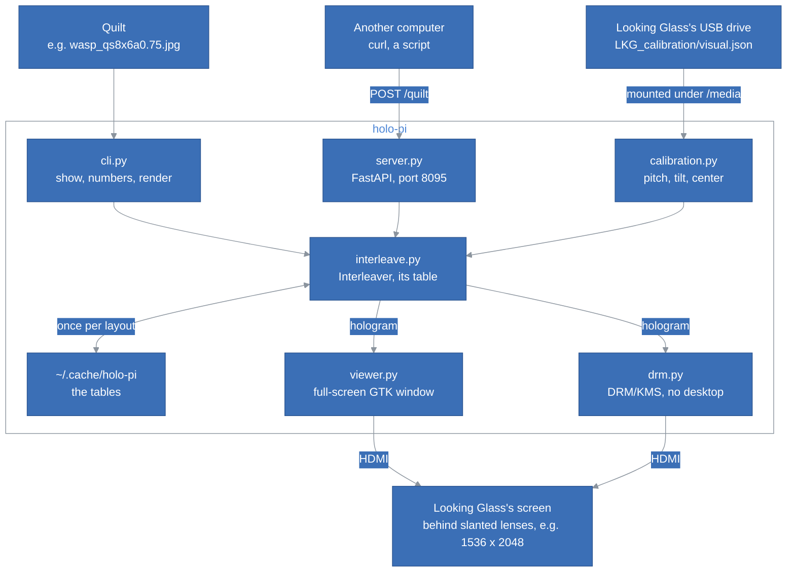

# HoloPi Architecture

## Table of Contents <!-- omit in toc -->

- [Introduction](#introduction)
- [The Big Picture](#the-big-picture)
- [The Parts](#the-parts)
- [The Calibration](#the-calibration)
- [The Interleaving](#the-interleaving)
  - [The Table](#the-table)
- [The Screens](#the-screens)
  - [The Desktop](#the-desktop)
  - [Wayland and X11](#wayland-and-x11)
  - [DRM/KMS](#drmkms)
- [The Server](#the-server)
  - [The Container](#the-container)
- [The Test Quilt](#the-test-quilt)
- [Tests](#tests)
- [How to Extend HoloPi](#how-to-extend-holopi)
- [Design Decisions and Trade-offs](#design-decisions-and-trade-offs)

## Introduction

This document explains how HoloPi is built, what each part is responsible for, and where to start when we want to change something. It assumes we have read the [README](../README.md).

HoloPi is made for the Looking Glass Portrait, and tested with it only; [How to Extend HoloPi](#how-to-extend-holopi) says what another model may need.

It follows one idea: **the display knows how it must be drawn**. Every Looking Glass carries its calibration on its own drive, and the formula that turns a quilt into the image its screen shows is a few lines of published math. HoloPi needs nothing else from Looking Glass: no service, no driver, no account.

## The Big Picture

A quilt goes through two steps. The interleaving turns it into the hologram, the image of the screen's size; a screen shows the hologram on the Looking Glass, pixel for pixel: a full-screen window on a desktop, or the screen itself, through DRM/KMS, without one. The quilt comes from a file, with the command line, or from another computer, through the server.



What HoloPi uses of the system:

| Name | Type | What it is |
|---|---|---|
| `/media/*/*/LKG_calibration/visual.json`, `/run/media/...` | file on the display's drive | The display's calibration, which the desktop mounts once the USB cable carries data. |
| `/dev/disk/by-label/LKG-*` | block device | The display's drive, which the server mounts itself with `--mount-drive`, as root, when nothing has, e.g. in its container. |
| The monitor of the calibration's size | GTK monitor | The Looking Glass, e.g. 1536 x 2048, part of the desktop at 100%. |
| `/dev/dri/card*` | DRM device | The graphics cards, whose connected screen of the hologram's size is the Looking Glass, without a desktop. |
| `~/.cache/holo-pi`, or `$XDG_CACHE_HOME/holo-pi` | folder | The tables of the interleaving, about 38 MB each for a Portrait. |
| `~/.local/state/holo-pi`, or `--state` | folder | The server's last quilt, `quilt.<suffix>` and `quilt.json`, to show it again after a restart. |
| Port 8095 | HTTP | The server's API, see [API.md](API.md). |

## The Parts

| File | Responsibility |
|---|---|
| [`holo_pi/calibration.py`](../holo_pi/calibration.py) | Finds and reads `visual.json`, and derives the values the interleaving needs. |
| [`holo_pi/layout.py`](../holo_pi/layout.py) | A quilt's layout, and reading it from a file's name, e.g. `_qs8x6a0.75`. |
| [`holo_pi/interleave.py`](../holo_pi/interleave.py) | The interleaving: the table, its cache, and the lookup. |
| [`holo_pi/quilt.py`](../holo_pi/quilt.py) | Reads a quilt's picture, from a file or from the bytes of an upload. |
| [`holo_pi/screen.py`](../holo_pi/screen.py) | Chooses the screen: the desktop if one runs, DRM/KMS otherwise. |
| [`holo_pi/viewer.py`](../holo_pi/viewer.py) | The desktop's screen: the full-screen window on the Looking Glass. |
| [`holo_pi/x11.py`](../holo_pi/x11.py) | Full-screen on a given monitor under X11, through libX11 and ctypes. |
| [`holo_pi/drm.py`](../holo_pi/drm.py) | The screen without a desktop: DRM/KMS, through libdrm and ctypes. |
| [`holo_pi/server.py`](../holo_pi/server.py) | The server: the quilt shown, kept on disk, and the FastAPI routes. |
| [`holo_pi/numbers.py`](../holo_pi/numbers.py) | The test quilt of numbered views. |
| [`holo_pi/cli.py`](../holo_pi/cli.py) | The command line: `show`, `render`, `numbers`, `calibration`, `serve`. |
| [`holo-pi`](../holo-pi) | The command, from a checkout, without installing it. |
| [`docker/`](../docker) | The server's container: its image, its compose file and `dock.sh`. |

Each part is loaded only when it is used: GTK only to show on a desktop, libdrm only to show without one, FastAPI only to serve. `render`, `calibration` and the library work without any of them, e.g. over ssh.

## The Calibration

`visual.json` holds, among others, the screen's size, `screenW` and `screenH`, its density, `DPI`, and the lenses: how many per inch, `pitch`, their slant, `slope`, and where the views start under them, `center`. Each value is a number or `{"value": number}`. [`calibration.py`](../holo_pi/calibration.py) derives what the interleaving needs, as Looking Glass's lenticular shader does in their [WebXR library](https://github.com/Looking-Glass/looking-glass-webxr):

| Value | From `visual.json` | What it is |
|---|---|---|
| `pitch` | `pitch × screenW / DPI × cos(atan(1 / slope))` | The lenses across the screen's width, along their slant. |
| `tilt` | `screenH / (screenW × slope)` | How far the lenses slant. |
| `subp` | `1 / (screenW × 3)` | One sub-pixel, as a fraction of the screen's width. |
| `center` | `center` | Where view 0 starts under a lens. |
| `inverted` | `invView` | The views go from right to left under a lens. |

`flipImageX`, a mirrored screen, reverses `tilt` and `subp`. The other values, e.g. `viewCone` or `fringe`, are for software that renders the views itself, not for a quilt.

## The Interleaving

The screen sits behind a sheet of slanted lenses, and each sub-pixel is seen from one direction only. The hologram gives each sub-pixel the colour of the view seen from that direction, at the same place in the view. For the sub-pixel `i`, 0 red, 1 green, 2 blue, of the pixel at `u, v`, from the bottom left of the screen in fractions of it, the view is:

```
((u + i × subp + v × tilt) × pitch − center) modulo 1, reversed if inverted, × the number of views
```

and the place in it is `u, v` again. The view's place in the quilt follows from the layout: view 0 at the bottom left, rows from the bottom up, as Looking Glass's tools lay it out. Each sub-pixel takes the nearest pixel of the quilt.

### The Table

Which sub-pixel of the quilt each sub-pixel of the screen takes depends only on the calibration, the layout and the quilt's size, not on the picture. An `Interleaver` works it out once, as a table of indices into the flat quilt, one per sub-pixel of the screen: 9.4 million for a Portrait, `int32`, about 38 MB. Turning a quilt into a hologram is then one lookup, `quilt.reshape(-1)[table]`:

| Step | Time on a PC |
|---|---|
| The table, once | about 360 ms |
| A quilt, with the table | about 15 ms |
| Reading a 3360 x 3360 PNG quilt | about 210 ms |

The table is saved in `~/.cache/holo-pi`, named after a hash of everything it depends on, including `TABLE_VERSION`, so a restart, or a Raspberry Pi, where everything is several times slower, skips it. A table that cannot be read is computed again; one that cannot be saved is only logged.

## The Screens

A screen shows a hologram on the Looking Glass. There are two, with the same methods, so that the command line and the server use either:

| Method | What it does |
|---|---|
| `show(hologram)` | Shows the hologram on the Looking Glass, the screen of the hologram's size, and returns where, e.g. `HDMI-A-1 of /dev/dri/card1, 1536 x 2048`. Raises `RuntimeError`, with what to check, when it cannot. Called from any thread but the main one. |
| `clear()` | Black on a DRM screen; closes the window on a desktop. |
| `run(stop)` | Runs on the main thread until the `threading.Event` `stop` is set, or `SIGINT` or `SIGTERM` arrives: GTK's loop on a desktop, a wait without one. |
| `close()` | Gives the screen back. |

[`screen.py`](../holo_pi/screen.py) opens the one `--screen` names, or chooses with `choose()`, from what the computer offers rather than from the environment:

1. **DRM/KMS when a card has a connected screen that no other program drives.** `screen_free()` of `drm.py` opens each card: a process that opens a card without a master becomes its master, and `drmIsMaster()`, which libdrm answers by asking to authenticate a client, something only the master may do, says so. This holds on a computer without a desktop, even over `ssh -X`, whose `DISPLAY` would point at another computer's desktop.
2. **The desktop when `DISPLAY` or `WAYLAND_DISPLAY` is set:** a desktop holds the screens, as GNOME does.
3. **DRM/KMS otherwise,** e.g. over ssh into a computer whose desktop holds the screens: its error says so, `another program drives the screens`.

The probe holds the card only while it looks, and closes it. The command line shows from a thread, while the main thread runs the screen, and prints `Showing on <where>` once it is shown: a program that runs it can wait for that line.

### The Desktop

[`viewer.py`](../holo_pi/viewer.py) shows the hologram in a GTK window, full-screen on the monitor of the hologram's size. One pixel off, and the hologram is drawn for the wrong lenses, so the window must cover that monitor exactly, at 100%: the viewer sets `GDK_SCALE=1` before GTK loads, whatever the desktop's scaling. Under X11, a whole factor, e.g. 200% on a 4K desktop, is applied by each program, and the screen keeps its pixels: the window still covers the Looking Glass pixel for pixel, checked on a Portrait at 200%. A fractional factor is not: GNOME scales the whole screen image, and no window can be pixel-exact. It hides the pointer.

GTK must run on the main thread, so `show()` hands the hologram to GTK's loop with `GLib.idle_add()`, and waits until the window covers the Looking Glass, at most 10 seconds. The window covers it once it is full-screen, of the screen's size, and, under X11, at the monitor's position. A new hologram on the same monitor only replaces the window's picture. Escape, `q` or closing the window ends the command; for the server, it only closes the window, until the next quilt.

### Wayland and X11

**Under Wayland,** Raspberry Pi OS's default and Ubuntu's, GTK asks the compositor for full-screen on the Looking Glass's monitor, `fullscreen_on_monitor()`, and the compositor does it. A Wayland client cannot know where its window is, so the viewer checks only that it is full-screen and of the screen's size.

**Under X11,** GNOME's window manager places a new window on the main monitor, and ignores both a request to move it and `fullscreen_on_monitor()`. It does make a window full-screen on a given monitor when asked as a pager would be, with the EWMH messages `_NET_WM_FULLSCREEN_MONITORS` and `_NET_WM_STATE` from source 2. [`x11.py`](../holo_pi/x11.py) sends them with libX11 and libXinerama through ctypes, on top of GTK's own request.


### DRM/KMS

[`drm.py`](../holo_pi/drm.py) shows the hologram without a desktop, the way a desktop shows itself: through DRM/KMS, the kernel's interface to the graphics cards. On a computer where no desktop runs, the first program to open a card is its master, and may set the mode of its screens. It calls libdrm through ctypes, as `x11.py` calls libX11:

1. It opens each `/dev/dri/card*`, and lists its connected screens and their modes. A card without screens, e.g. the Raspberry Pi 5's `v3d`, which only renders, has none.
2. The Looking Glass is the screen with a mode of the hologram's size, 1536 x 2048 for a Portrait, its preferred mode: the one the screen asks for first, then the highest refresh.
3. It finds the display controller, the CRTC, that drives that screen, and saves what it showed, e.g. the console.
4. It creates two dumb buffers of the screen's size, images in memory that the display controller scans out as they are, and maps them into the process.
5. `show()` writes the hologram into the buffer not on the screen, as XRGB8888, blue, green, red and a padding byte per pixel, the format every display controller reads, then gives that buffer to the controller with the mode, `drmModeSetCrtc()`. The screen never shows half of one hologram and half of the next.
6. `close()` gives the controller back what it showed, and the console comes back. A process that dies gives it back too: the kernel closes the card.

The easy detail to break is the row length: a buffer's rows are `pitch` bytes apart, which the kernel chooses, and which may be more than 4 bytes per pixel. When a mode set fails, e.g. because the Looking Glass was unplugged and plugged in again, `show()` closes the card and looks for the screen once more. When it fails with `EACCES`, another program, a desktop, is the master: the message says so.

## The Server

[`server.py`](../holo_pi/server.py) is `holo-pi serve`: FastAPI routes, documented in [API.md](API.md), on uvicorn, which runs on a thread of its own, while the main thread runs the screen. It shows one quilt at a time, the last one uploaded.

`Display` holds what is shown, behind one lock, so that two uploads at once are shown one after the other:

- **The calibration,** read at the first quilt, then kept. When the drive is not mounted and the server was started with `--mount-drive`, it mounts it itself, read-only, as root, by its label, `/dev/disk/by-label/LKG-*`, under `/media/holo-pi`, with `mount_drives()` of [`calibration.py`](../holo_pi/calibration.py).
- **The tables** of the last two layouts and sizes of quilt, in memory, about 38 MB each: a quilt of the same layout is a lookup.
- **The quilt,** its picture, and a copy of the uploaded file in the state folder, with `quilt.json`, which says its name, layout and order. At start, `restore()` takes it back, or, when none is kept, the default quilt of `--default-quilt`, which is shown and not kept: an upload replaces it, and the next start shows it again.
- **Whether it is shown,** where, or why not.

An upload is checked first: an image, of a layout from its name or its fields; otherwise `400`, and the quilt before stays. A good quilt replaces the one before, on disk too, even when it cannot be shown: no calibration, or no screen of its size. The server then answers `503` with the reason, and a thread tries again every 5 seconds, so that the quilt shows as soon as the Looking Glass is plugged in or switched on, and after a restart before it is.

### The Container

[`docker/`](../docker) runs the server in a container, `holo-pi`, on a computer without a desktop, driven by [`dock.sh`](../docker/dock.sh):

| What | Why |
|---|---|
| `debian:trixie-slim`, with Debian's packages of Python, numpy, Pillow, FastAPI, uvicorn, python-multipart and libdrm | Built for amd64 and arm64: the image installs packages, with nothing to compile, also on a Raspberry Pi. |
| The repo, mounted read-only on `/holo-pi` | The image holds no code: a `git pull` and a restart update the server. |
| `privileged`, as root, with `--mount-drive` | Setting a screen's mode, and mounting the Looking Glass's drive, need it; nothing else mounts the drive in the container. |
| `/dev` of the host | The cards and the drive, which come back under new names when the Looking Glass is unplugged and plugged in again. |
| `/media` of the host, read-only, as `/run/media` | A drive the host has mounted, e.g. by a desktop, is found there; the container could not mount it again. |
| The volume `holo-pi_state`, on `/var/lib/holo-pi` | The last quilt and the tables survive a restart and a new image. |
| `--default-quilt`, the test quilt, or `HOLO_PI_DEFAULT_QUILT` | Something on the Looking Glass from the first start, rather than the console. |
| `network_mode: host`, `restart: unless-stopped` | The server on the host's port 8095, started with the computer. |

## The Test Quilt

[`numbers.py`](../holo_pi/numbers.py) makes a Portrait's quilt of 48 views, each showing its number on a colour of its own, the hues around the colour wheel. Through the lenses of a display that interleaves right, one number fills the screen, and changes in order as the viewer moves. If the interleaving is wrong, every direction mixes many views, and the colours average to a white blur. The digits are drawn as seven segments with numpy: no font, so the test quilt is the same with every Pillow.

## Tests

`python3 -m unittest discover tests` runs the automated tests, without a display:

| Test | What it covers |
|---|---|
| `CalibrationTest` | The values derived from a Portrait's `visual.json`, a mirrored screen, finding the drive under a mount, the message when there is none, and mounting a drive that nothing mounted. |
| `LayoutTest` | Reading the layout from a file's name. |
| `InterleaveTest` | The hologram's size, one view per sub-pixel with every view seen, 2000 sub-pixels against the views of an earlier implementation checked through a Portrait's lenses, `invView` and `--reverse`, the cached table, and a quilt of the wrong size. |
| `NumbersTest` | The test quilt's size, its 48 colours and its digits. |
| `CommandLineTest` | `render`, `numbers` and `calibration`, `Showing on` from `show` with a fake screen, and the demo quilt's layout. |
| `DrmTest` | The ioctls against the kernel's numbers, the choice of the Looking Glass's mode, the pixel format, and the message without a card. |
| `ScreenChoiceTest` | `auto`: DRM/KMS on a screen that nothing drives whatever `DISPLAY` says, the desktop when it holds the screens, DRM/KMS without either, a kind given kept, and the master's test. |
| `ServerTest`, in [`test_server.py`](../tests/test_server.py) | Every route with a fake screen: an upload interleaved and shown, the layout from the fields, a quilt refused, a quilt kept while the screen is off and shown when it is on, the last quilt after a restart, the default quilt when none is kept, by its name or `numbers`, and not over a kept one, the quilt read back and removed, the test quilt, the status, the calibration, the drive mounted only with `--mount-drive`, and a summary and a description for every route. Skipped without FastAPI, httpx and python-multipart. |

The reference views of [`tests/reference_views.json`](../tests/reference_views.json) allow 1% to differ: at the edge between two views, floating-point rounding may differ between processors, e.g. a PC and a Raspberry Pi. The calibration of [`tests/portrait_visual.json`](../tests/portrait_visual.json) is a real Portrait's, with its serial number replaced.

Checked by hand:

| Part | How to check it |
|---|---|
| The desktop | `holo-pi numbers`: one number through the lenses, changing in order. On a desktop with another monitor, the window must go to the Looking Glass, not the main monitor. |
| DRM/KMS | `holo-pi numbers --screen drm` on a computer without a desktop: the same, and the console back after Ctrl+C. |
| The server | `holo-pi serve`, then `curl -F file=@quilts/wasp_qs8x6a0.75.jpg http://localhost:8095/quilt`; unplug the Looking Glass's HDMI, upload again, plug it in: the quilt shows within 5 seconds. |
| The container | `./docker/dock.sh start` on a Raspberry Pi without a desktop, an upload from another computer, then a reboot of the Pi: the same quilt comes back. |
| The interleaving | `holo-pi show` with a quilt that looks right with Looking Glass's own software on another computer. |

## How to Extend HoloPi

**Support another Looking Glass model.** Check it with `holo-pi numbers`. If the numbers mix, compare its `visual.json` with a Portrait's: a value the Portrait does not have, e.g. `subpixelCells`, which describes sub-pixels laid out differently, belongs in `Calibration` and in `table()`, and `TABLE_VERSION` goes up.

**Add a route to the server.** Add it in `create_app()`, with a `summary`, a docstring, which becomes its description, and a response model whose fields have a `description`: `test_documents_every_route` checks the first two. Anything that changes what is shown goes through `Display`, under its lock. Add it to [API.md](API.md).

**Show on another kind of screen.** Write a class with `show`, `clear`, `run` and `close`, as [The Screens](#the-screens) describes, and open it in `open_screen()`.

**Rotate the hologram for a screen that reports its mode sideways.** A Portrait reports 1536 x 2048, its own orientation. A screen that reports 2048 x 1536 needs the hologram turned before `xrgb()` in `drm.py`, and `find_output()` to accept the turned size.

## Design Decisions and Trade-offs

**Our own interleaving, not Looking Glass's software.** Looking Glass Bridge 2.6.3, the service their tools draw through, showed every quilt flat, as a grid of views, on a GNOME desktop under X11, and it is built for x86 only, so not for a Raspberry Pi. The interleaving is published math, and the calibration is on the display's drive. The price: what Bridge adds, e.g. video quilts or Looking Glass's newer models' particular calibrations, is not here.

**numpy on the CPU, not a shader on the GPU.** Still images need the hologram once: with the table, a quilt takes about 15 ms on a PC, less than reading its file. A shader would be needed for video or an interactive scene, at the price of OpenGL on every desktop and a Raspberry Pi.

**The nearest pixel of the quilt, not a blend of four.** A shader samples the quilt linearly; the nearest pixel keeps the table to one index per sub-pixel. Through the lenses, the difference does not show.

**Pillow, not OpenCV.** Raspberry Pi OS packages both, but Pillow is smaller, and enough to read and write images.

**DRM/KMS without a desktop, not a desktop on the Raspberry Pi.** A desktop on a small computer costs memory, and it mounts every USB drive and camera it sees, which another program on the same computer may need. Without it, the screen is the program's own: no window to place, no scaling, no other monitor to land on.

**libdrm through ctypes, not kmsxx or pykms.** libdrm is installed with every Linux that shows anything, Raspberry Pi OS Lite and Debian's slim image included; Python's bindings of kmsxx are packaged by Raspberry Pi OS only. A dozen of its functions and three ioctls are enough for one still image, as libX11 is enough for `x11.py`.

**Dumb buffers, written by the CPU, not the GPU.** A still image is written once, 12 MB, in a few milliseconds: the GPU would add OpenGL or Vulkan for nothing. The price is a switch at a time of our choosing, not on the screen's vertical blank: the change from one hologram to the next may tear for one frame.

**FastAPI, not a plain HTTP server.** It documents the API from the code, on `/docs`, with a form to try each route, checks the fields, and Debian and Ubuntu package it, with uvicorn. The price: three more packages, for the server only.

**One quilt, kept on disk, not a queue or a playlist.** A Looking Glass shows one hologram at a time; the last one uploaded is the one wanted. Keeping it lets a computer that reboots, e.g. after a power cut, show it again without anyone uploading it.

**`503` and a retry, not a refusal, when the Looking Glass is not ready.** The computer that makes quilts should not have to know whether the display is switched on: it uploads, and the quilt shows when it can.

**GTK 3, through PyGObject.** Raspberry Pi OS and Ubuntu install it with their desktops, it runs on Wayland and X11, and it can ask for full-screen on a given monitor. The X11 detour through EWMH messages is the price of GNOME's window placement there.
