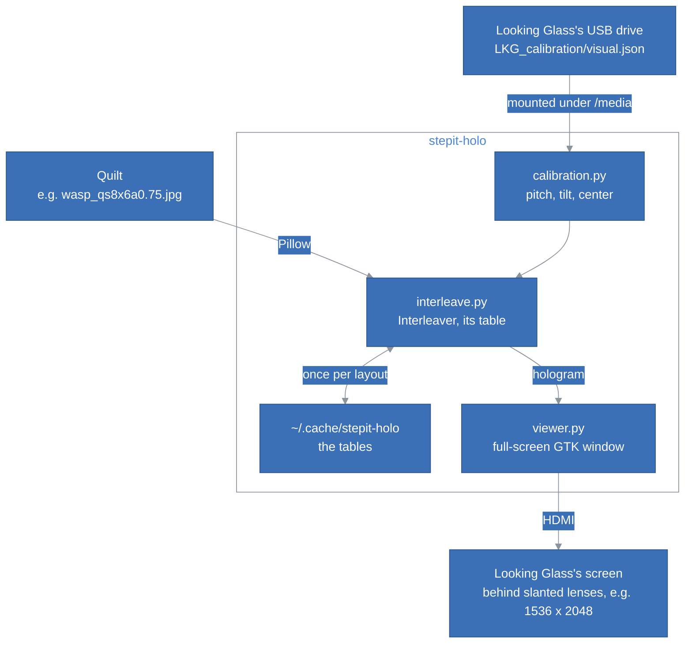

# StepIt Holo Architecture

## Table of Contents <!-- omit in toc -->

- [Introduction](#introduction)
- [The Big Picture](#the-big-picture)
- [The Parts](#the-parts)
- [The Calibration](#the-calibration)
- [The Interleaving](#the-interleaving)
  - [The Table](#the-table)
- [The Viewer](#the-viewer)
  - [Wayland and X11](#wayland-and-x11)
- [The Test Quilt](#the-test-quilt)
- [Tests](#tests)
- [How to Extend StepIt Holo](#how-to-extend-stepit-holo)
- [Design Decisions and Trade-offs](#design-decisions-and-trade-offs)

## Introduction

This document explains how StepIt Holo is built, what each part is responsible for, and where to start when we want to change something. It assumes we have read the [README](../README.md).

It follows one idea: **the display knows how it must be drawn**. Every Looking Glass carries its calibration on its own drive, and the formula that turns a quilt into the image its screen shows is a few lines of published math. StepIt Holo needs nothing else from Looking Glass: no service, no driver, no account.

## The Big Picture

A quilt goes through two steps. The interleaving turns it into the hologram, the image of the screen's size; the viewer shows the hologram on the Looking Glass's monitor, pixel for pixel.



What StepIt Holo uses of the system:

| Name | Type | What it is |
|---|---|---|
| `/media/*/*/LKG_calibration/visual.json`, `/run/media/...` | file on the display's drive | The display's calibration, which the desktop mounts once the USB cable carries data. |
| The monitor of the calibration's size | GTK monitor | The Looking Glass, e.g. 1536 x 2048, part of the desktop at 100%. |
| `~/.cache/stepit-holo`, or `$XDG_CACHE_HOME/stepit-holo` | folder | The tables of the interleaving, about 38 MB each for a Portrait. |

## The Parts

| File | Responsibility |
|---|---|
| [`stepit_holo/calibration.py`](../stepit_holo/calibration.py) | Finds and reads `visual.json`, and derives the values the interleaving needs. |
| [`stepit_holo/layout.py`](../stepit_holo/layout.py) | A quilt's layout, and reading it from a file's name, e.g. `_qs8x6a0.75`. |
| [`stepit_holo/interleave.py`](../stepit_holo/interleave.py) | The interleaving: the table, its cache, and the lookup. |
| [`stepit_holo/viewer.py`](../stepit_holo/viewer.py) | The full-screen window on the Looking Glass. |
| [`stepit_holo/x11.py`](../stepit_holo/x11.py) | Full-screen on a given monitor under X11, through libX11 and ctypes. |
| [`stepit_holo/numbers.py`](../stepit_holo/numbers.py) | The test quilt of numbered views. |
| [`stepit_holo/cli.py`](../stepit_holo/cli.py) | The command line: `show`, `render`, `numbers`, `calibration`. |
| [`stepit-holo`](../stepit-holo) | The command, from a checkout, without installing it. |

Only `viewer.py` and `x11.py` need a desktop, and they are loaded only to show: `render`, `calibration` and the library work without one, e.g. over ssh.

## The Calibration

`visual.json` holds, among others, the screen's size, `screenW` and `screenH`, its density, `DPI`, and the lenses: how many per inch, `pitch`, their slant, `slope`, and where the views start under them, `center`. Each value is a number or `{"value": number}`. [`calibration.py`](../stepit_holo/calibration.py) derives what the interleaving needs, as Looking Glass's lenticular shader does in their [WebXR library](https://github.com/Looking-Glass/looking-glass-webxr):

| Value | From `visual.json` | What it is |
|---|---|---|
| `pitch` | `pitch × screenW / DPI × cos(atan(1 / slope))` | The lenses across the screen's width, along their slant. |
| `tilt` | `screenH / (screenW × slope)` | How far the lenses slant. |
| `subp` | `1 / (screenW × 3)` | One sub-pixel, as a fraction of the screen's width. |
| `center` | `center` | Where view 0 starts under a lens. |
| `inverted` | `invView` | The views go from right to left under a lens. |

`flipImageX`, a mirrored screen, reverses `tilt` and `subp`. The other values, e.g. `viewCone` or `fringe`, are for software that renders the views itself, not for a quilt.

## The Interleaving

The screen sits behind a sheet of slanted lenses, and each sub-pixel is seen from one direction only. The hologram gives each sub-pixel the colour of the view seen from that direction, at the same place in the view. For the sub-pixel `i`, 0 red, 1 green, 2 blue, of the pixel at `u, v`, from the bottom left of the screen in fractions of it, the view is:

```
((u + i × subp + v × tilt) × pitch − center) modulo 1, reversed if inverted, × the number of views
```

and the place in it is `u, v` again. The view's place in the quilt follows from the layout: view 0 at the bottom left, rows from the bottom up, as Looking Glass's tools lay it out. Each sub-pixel takes the nearest pixel of the quilt.

### The Table

Which sub-pixel of the quilt each sub-pixel of the screen takes depends only on the calibration, the layout and the quilt's size, not on the picture. An `Interleaver` works it out once, as a table of indices into the flat quilt, one per sub-pixel of the screen: 9.4 million for a Portrait, `int32`, about 38 MB. Turning a quilt into a hologram is then one lookup, `quilt.reshape(-1)[table]`:

| Step | Time on a PC |
|---|---|
| The table, once | about 360 ms |
| A quilt, with the table | about 15 ms |
| Reading a 3360 x 3360 PNG quilt | about 210 ms |

The table is saved in `~/.cache/stepit-holo`, named after a hash of everything it depends on, including `TABLE_VERSION`, so a restart, or a Raspberry Pi, where everything is several times slower, skips it. A table that cannot be read is computed again; one that cannot be saved is only logged.

## The Viewer

[`viewer.py`](../stepit_holo/viewer.py) shows the hologram in a GTK window, full-screen on the monitor of the calibration's size. One pixel off, and the hologram is drawn for the wrong lenses, so the window must cover that monitor exactly, at 100%: the viewer sets `GDK_SCALE=1` before GTK loads, whatever the desktop's scaling. Under X11, a whole factor, e.g. 200% on a 4K desktop, is applied by each program, and the screen keeps its pixels: the window still covers the Looking Glass pixel for pixel, checked on a Portrait at 200%. A fractional factor is not: GNOME scales the whole screen image, and no window can be pixel-exact. It hides the pointer, and closes on Escape or `q`.

It prints `Showing on the monitor at x, y, width x height` once the window is full-screen and of the screen's size, and, under X11, at the monitor's position. A program that runs it can wait for that line.

### Wayland and X11

**Under Wayland,** Raspberry Pi OS's default and Ubuntu's, GTK asks the compositor for full-screen on the Looking Glass's monitor, `fullscreen_on_monitor()`, and the compositor does it. A Wayland client cannot know where its window is, so the viewer checks only that it is full-screen and of the screen's size.

**Under X11,** GNOME's window manager places a new window on the main monitor, and ignores both a request to move it and `fullscreen_on_monitor()`. It does make a window full-screen on a given monitor when asked as a pager would be, with the EWMH messages `_NET_WM_FULLSCREEN_MONITORS` and `_NET_WM_STATE` from source 2. [`x11.py`](../stepit_holo/x11.py) sends them with libX11 and libXinerama through ctypes, on top of GTK's own request.

## The Test Quilt

[`numbers.py`](../stepit_holo/numbers.py) makes a Portrait's quilt of 48 views, each showing its number on a colour of its own, the hues around the colour wheel. Through the lenses of a display that interleaves right, one number fills the screen, and changes in order as the viewer moves. If the interleaving is wrong, every direction mixes many views, and the colours average to a white blur. The digits are drawn as seven segments with numpy: no font, so the test quilt is the same with every Pillow.

## Tests

`python3 -m unittest discover tests` runs the automated tests, without a display:

| Test | What it covers |
|---|---|
| `CalibrationTest` | The values derived from a Portrait's `visual.json`, a mirrored screen, finding the drive under a mount, and the message when there is none. |
| `LayoutTest` | Reading the layout from a file's name. |
| `InterleaveTest` | The hologram's size, one view per sub-pixel with every view seen, 2000 sub-pixels against the views of an earlier implementation checked through a Portrait's lenses, `invView` and `--reverse`, the cached table, and a quilt of the wrong size. |
| `NumbersTest` | The test quilt's size, its 48 colours and its digits. |
| `CommandLineTest` | `render`, `numbers` and `calibration`, and the demo quilt's layout. |

The reference views of [`tests/reference_views.json`](../tests/reference_views.json) allow 1% to differ: at the edge between two views, floating-point rounding may differ between processors, e.g. a PC and a Raspberry Pi. The calibration of [`tests/portrait_visual.json`](../tests/portrait_visual.json) is a real Portrait's, with its serial number replaced.

Checked by hand:

| Part | How to check it |
|---|---|
| The viewer | `stepit-holo numbers`: one number through the lenses, changing in order. On a desktop with another monitor, the window must go to the Looking Glass, not the main monitor. |
| The interleaving | `stepit-holo show` with a quilt that looks right with Looking Glass's own software on another computer. |

## How to Extend StepIt Holo

**Support another Looking Glass model.** Check it with `stepit-holo numbers`. If the numbers mix, compare its `visual.json` with a Portrait's: a value the Portrait does not have, e.g. `subpixelCells`, which describes sub-pixels laid out differently, belongs in `Calibration` and in `table()`, and `TABLE_VERSION` goes up.

**Show quilts one after the other.** Keep one `Interleaver` per layout and size, and give the viewer's window a new pixbuf: the table makes each quilt a lookup.

**Show on a Raspberry Pi without a desktop.** The viewer needs GTK and a desktop. Without one, the hologram could go straight to the screen through DRM/KMS, e.g. with `kmsxx`, the interleaving unchanged.

## Design Decisions and Trade-offs

**Our own interleaving, not Looking Glass's software.** Looking Glass Bridge 2.6.3, the service their tools draw through, showed every quilt flat, as a grid of views, on a GNOME desktop under X11, and it is built for x86 only, so not for a Raspberry Pi. The interleaving is published math, and the calibration is on the display's drive. The price: what Bridge adds, e.g. video quilts or Looking Glass's newer models' particular calibrations, is not here.

**numpy on the CPU, not a shader on the GPU.** Still images need the hologram once: with the table, a quilt takes about 15 ms on a PC, less than reading its file. A shader would be needed for video or an interactive scene, at the price of OpenGL on every desktop and a Raspberry Pi.

**The nearest pixel of the quilt, not a blend of four.** A shader samples the quilt linearly; the nearest pixel keeps the table to one index per sub-pixel. Through the lenses, the difference does not show.

**Pillow, not OpenCV.** Raspberry Pi OS packages both, but Pillow is smaller, and enough to read and write images.

**GTK 3, through PyGObject.** Raspberry Pi OS and Ubuntu install it with their desktops, it runs on Wayland and X11, and it can ask for full-screen on a given monitor. The X11 detour through EWMH messages is the price of GNOME's window placement there.
